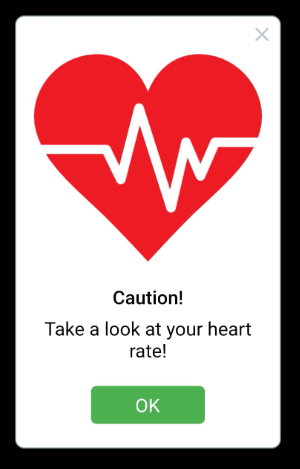

# IoT - DiaHelp

## Autors

This project was developed by the following people:
-  [Ricard Lopez](https://github.com/Ricardlol)
-  [Iker Soto](https://github.com/isotopi)
-  [Bruno Moya](https://github.com/elblogbruno)

## index
1. [Introduction](#Introduction)
2. [Requirements](#Requirements)
3. [Structure](#Structure)
4. [Importants Files](#importants-files)
5. [Demo](#demo-video)

## Introduction

This project contains the project DiaHelp Source Code. It contains the Arduino Source Code, the Python API, the Android App and the Data Analysis Code in R.

## Requirements
- [PlatformIo](https://platformio.org/install/ide?install=vscode)
- [Flutter](https://docs.flutter.dev/get-started/install)
- [R and R studio](https://rstudio-education.github.io/hopr/starting.html)
- Library used:
    - [FastApi](https://fastapi.tiangolo.com/)
    - [http flutter](https://pub.dev/packages/http)
    
## Structure

- Placa folder contains the Arduino Source Code
- api contains the python API code
- app_new contains the source code of the phone app
- data_analysis contains the R code of the data analysis.

## Importants Files

Inside the structure of the project, there are some more important files, which are of configuration or directly the most important code, these files are:
- Placa: 
    - src/main.cpp: Code to device send data to edge.
    - platformio.ini: It contains a configuration for a nordi52, if we want that code in other PCB, we have changed this file.
- api: 
    - main.py: contain the endpoints of api.
    - models/models.py: see the tables of database and use as model.
- app_new:
    - package/flutter_reactive_ble: Old app, this we can selected a device.
    - package/reactive_ble_mobile: Final app, it connected to device automaticaly, show data, send data to server, recieve data to Device. 

- data_analysis:
    - dataanalysis.R: file with code for analysis data.
## Demo Video

